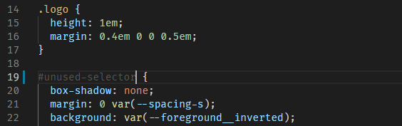

# Tools

Let's see if we can use some tools for help. Aim here is to reduce code duplication throughout the app or which will inform us about unused (but packed) styles.

Trying to be an optimist, let's do some internet check:

## npm packages / utilities

> DISCLAIMER  
 As most of these tools is just trying to analyze your CSS bundle comparing it to JS/HTML/any template files based on regular expressions, it may (and I bet it will) remove more content from your CSS bundles, so you need to double check if you need to _whitelist_ / _blacklist_ some of your files or selectors. Or at least you need to check you UI framework documentaion thoroughly.  
 And last, but not least: __none of these will try to optimize your component styles__.

* [ngx-unused-css](https://github.com/ivanblazevic/ngx-unused-css/)
 
   Small, slightly buggy tool to provide you with a list of possible selectors, which are not in use. I've summarized my short test [here](./ngx-unused-css.md).

* [purge-css](https://purgecss.com/)
 
    A library bit famous thanks to [TailwindCSS](https://tailwindcss.com/). The whole principle is a file parser which analyses your template files and your CSS files. it has no native support for [Angular](https://angular.io/), but you can configure it to run after your build e.g. using by a [custom webpack config](https://medium.com/@joao.a.edmundo/angular-cli-tailwindcss-purgecss-2853ef422c02). Risky part here is, that it may easily remove style rules which are in use, but are not that easily recognizable (e.g. because of the component nesting, or custom JS threated classes), but if you are patient enough, you may find a right set of rules using both [`safelist`](https://purgecss.com/safelisting.html#specific-selectors) and [`blocklist`](https://purgecss.com/configuration.html#configuration-file) options.

      
    Worth to mention here is a [PostCSS plugin](https://purgecss.com/plugins/postcss.html), or that you may get a quick purge-css setup next to a tailwind using [tailwind](https://github.com/ngneat/tailwind)  package by [ngneat](https://github.com/ngneat/tailwind).

* [TailwindCSS](https://tailwindcss.com/)
 
    Ng-hype of 2020, which uses already mentioned Purge-CSS library in the background. Beware - it uses it mainly to remove unused selectors from it's huge variety of generated options, but it seems that creators are giving you an option to [configure purge-css](https://tailwindcss.com/docs/optimizing-for-production#purge-css-options) as it becomes a part of your project setup already.  
    An important highlight here may be Tailwind 2.1+ with their [just in time](https://tailwindcss.com/docs/just-in-time-mode) mode, which may make purge-css usage for tailwind framework obsolete.  
    > BEWARE: By default, Tailwind will only remove unused classes that it generates [by itself](https://tailwindcss.com/docs/optimizing-for-production#removing-all-unused-styles).

* [ngneat/tailwind](https://github.com/ngneat/tailwind)
 
    Angular-ready setup for your project. Honestly I did find purge-css setup painful and guys from [ngneat](https://github.com/ngneat) have proven to be a great help for Angular community again. But please keep in mind the warning from previous paragraph.

* Similar libraries just for evidence (I'm skeptical about their practical use in any Angular project):
  * [purifycss](https://github.com/purifycss/purifycss)
  * [uncss](https://github.com/uncss/uncss)
 
    

## VS code plugins

* [Unused CSS Classes for JavaScript/Angular/React](https://dev.to/dylanvdmerwe/reduce-angular-style-size-using-purgecss-to-remove-unused-styles-3b2k)
  
    Quick & neat. I do love this tool although it highlights slightly more selectors then necessary, but it helps you with typos and redundant styles. Unluckily it is just a syntax highlighter, so no batch use or project audit is possible.
    
    

## Browser tools

If you finished to read previous two chapters, you've noticed it looks like  always - we need to solve most of the things on our own, so let's mention our original helpers - browser dev tools.

1. _Google Lighthouse_ - chrome defaults / Firefox  extension.  
General auditing tool which evaluates _performance_, _accessibility_, some _best_practices_, _SEO_ and _PWA_.   
   It's good to run it once in a while to check whether you're loosing some points maybe thanks to e.g. redundant DOM elements.
2. _Coverage_ - Chrome utility  
   which takes a look at each JS/CSS resource and informs you about unused code. Trick here is here that it analyses only a current page view, so many unused rules may be used elsewhere in your application

For an evidence, [here is a comprehensive list of online tools](https://stackoverflow.com/questions/135657/how-to-identify-unused-css-definitions-from-multiple-css-files-in-a-project), but I don't find them useful for any of my current project setups, as they are mostly local / internal.

## Wrap Up

When it comes to application bundle size, it may seem that most of the dirty work is again in the shoulders of developer and doing audit every other moment may be time consuming. Here I'd like to propose a easy framework how to reduce the code duplication and improve web-app performance taking account also best-practices for CSS which I tried to [summarize here](./css-best-practices.md).
